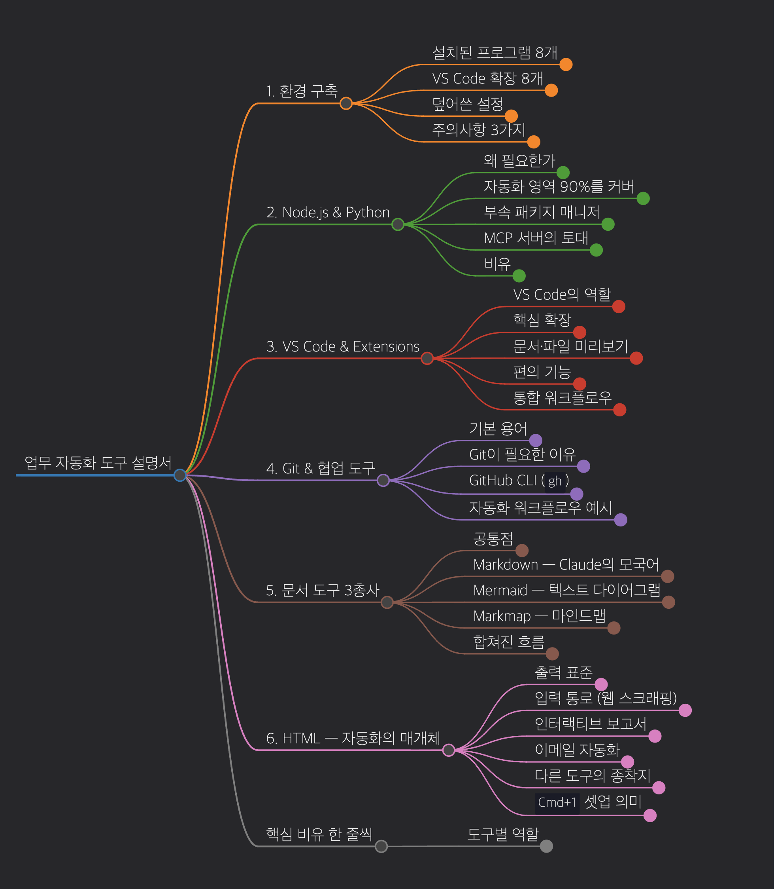
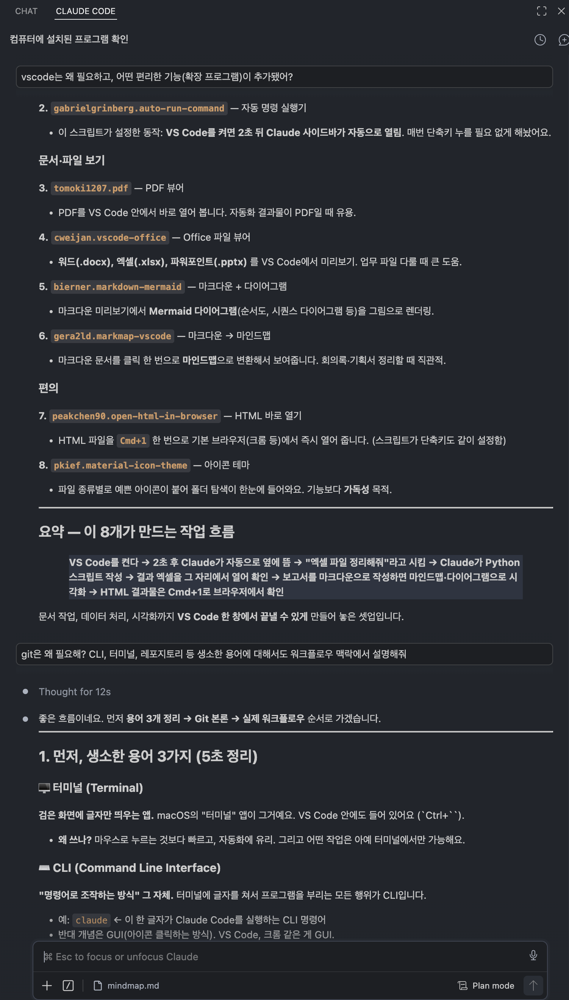
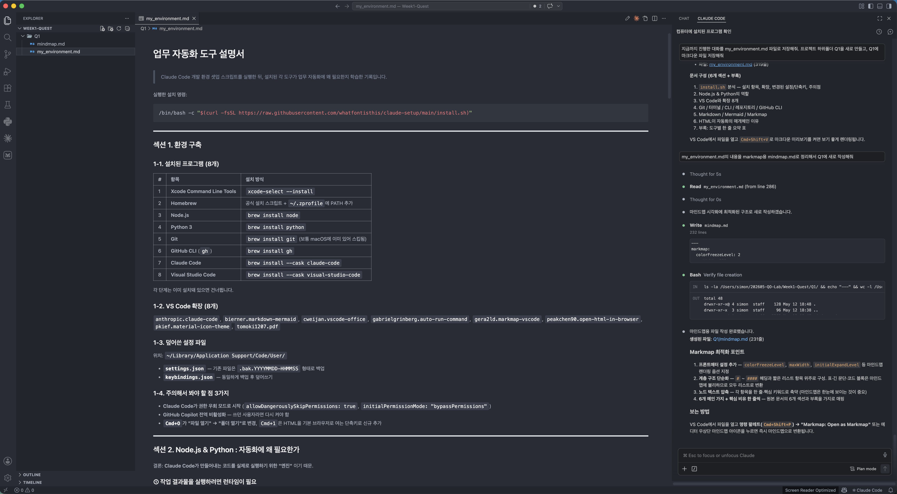

# 업무 자동화 도구 설명서

> Claude Code 개발 환경 셋업 스크립트를 실행한 뒤,
> 설치된 각 도구가 업무 자동화에 왜 필요한지 학습한 기록입니다.

실행한 설치 명령:

```bash
/bin/bash -c "$(curl -fsSL https://raw.githubusercontent.com/whatfontisthis/claude-setup/main/install.sh)"
```

---

## 섹션 1. 환경 구축

### 1-1. 설치된 프로그램 (8개)

| # | 항목 | 설치 방식 |
|---|------|-----------|
| 1 | **Xcode Command Line Tools** | `xcode-select --install` |
| 2 | **Homebrew** | 공식 설치 스크립트 + `~/.zprofile`에 PATH 추가 |
| 3 | **Node.js** | `brew install node` |
| 4 | **Python 3** | `brew install python` |
| 5 | **Git** | `brew install git` (보통 macOS에 이미 있어 스킵됨) |
| 6 | **GitHub CLI** (`gh`) | `brew install gh` |
| 7 | **Claude Code** | `brew install --cask claude-code` |
| 8 | **Visual Studio Code** | `brew install --cask visual-studio-code` |

각 단계는 이미 설치돼 있으면 건너뜁니다.

### 1-2. VS Code 확장 (8개)

`anthropic.claude-code`, `bierner.markdown-mermaid`, `cweijan.vscode-office`, `gabrielgrinberg.auto-run-command`, `gera2ld.markmap-vscode`, `peakchen90.open-html-in-browser`, `pkief.material-icon-theme`, `tomoki1207.pdf`

### 1-3. 덮어쓴 설정 파일

위치: `~/Library/Application Support/Code/User/`

- **`settings.json`** — 기존 파일은 `.bak.YYYYMMDD-HHMMSS` 형태로 백업
- **`keybindings.json`** — 동일하게 백업 후 덮어쓰기

### 1-4. 주의해서 봐야 할 점 3가지

- **Claude Code가 권한 우회 모드로 시작** (`allowDangerouslySkipPermissions: true`, `initialPermissionMode: "bypassPermissions"`)
- **GitHub Copilot 전역 비활성화** — 쓰던 사용자라면 다시 켜야 함
- **`Cmd+O`가 "파일 열기" → "폴더 열기"로 변경**, `Cmd+1`은 HTML을 기본 브라우저로 여는 단축키로 신규 추가

---

## 섹션 2. Node.js & Python : 자동화에 왜 필요한가

결론: **Claude Code가 만들어내는 코드를 실제로 실행하기 위한 "엔진"** 이기 때문.

### ① 작업 결과물을 실행하려면 런타임이 필요

- **Python** → `.py` 파일을 실행하는 엔진
- **Node.js** → `.js`/`.ts` 파일을 실행하는 엔진

런타임이 없으면 Claude가 아무리 멋진 자동화 스크립트를 짜줘도 실행할 수 없음.

### ② 업무 자동화의 90%는 이 두 언어로 굴러감

| 자동화 작업 | 주로 쓰는 도구 |
|---|---|
| 엑셀/PDF 처리, 데이터 정리 | Python (`pandas`, `openpyxl`) |
| 웹 크롤링, API 호출 | Python 또는 Node.js |
| 슬랙/노션/구글 시트 자동화 | 둘 다 (공식 SDK가 양쪽에 다 있음) |
| 파일 정리, 이름 일괄 변경 | Python |
| 웹사이트/대시보드 만들기 | Node.js |

### ③ 라이브러리 설치 통로(`pip`, `npm`)가 따라옴

Python을 설치하면 `pip`, Node.js를 설치하면 `npm`이 같이 설치됨. 남이 만든 자동화 부품을 한 줄 명령으로 가져다 쓸 수 있는 통로.

### ④ Claude Code 확장(MCP 서버)도 이 위에서 동작

노션·깃허브·슬랙 같은 외부 도구를 Claude에 연결하는 MCP 서버 대부분이 Node.js 또는 Python으로 배포됨.

> **요약**: Claude는 "요리사", Python/Node.js는 "주방의 가스레인지". 요리사가 와도 가스레인지가 없으면 요리가 안 됨.

---

## 섹션 3. VS Code & Extensions

### 3-1. VS Code가 필요한 이유

1. **Claude를 사이드바에 띄워 놓고 작업** — 왼쪽 코드, 오른쪽 Claude 대화창
2. **Claude가 만든 파일을 즉시 확인/수정** — 변경된 파일이 색깔로 표시, diff 비교 가능
3. **통합 터미널** — 별도 터미널 앱 없이 VS Code 하단에서 명령 실행
4. **확장으로 무한 확장 가능**

### 3-2. 확장 8개 — 각자의 역할

**핵심**
- **`anthropic.claude-code`** — Claude Code 공식 확장. 사이드바에서 직접 대화
- **`gabrielgrinberg.auto-run-command`** — VS Code 시작 후 2초 뒤 Claude 사이드바 자동 오픈

**문서·파일 보기**
- **`tomoki1207.pdf`** — PDF를 VS Code 안에서 보기
- **`cweijan.vscode-office`** — 워드(.docx), 엑셀(.xlsx), 파워포인트(.pptx) 미리보기
- **`bierner.markdown-mermaid`** — 마크다운 미리보기에서 Mermaid 다이어그램 렌더링
- **`gera2ld.markmap-vscode`** — 마크다운을 마인드맵으로 변환

**편의**
- **`peakchen90.open-html-in-browser`** — HTML 파일을 `Cmd+1`로 즉시 브라우저 열기
- **`pkief.material-icon-theme`** — 파일 종류별 예쁜 아이콘 (가독성 향상)

### 3-3. 8개가 만드는 작업 흐름

> VS Code 켜기 → 2초 후 Claude 자동 등장 → "엑셀 정리해줘" → Claude가 Python 작성
> → 결과 엑셀을 그 자리에서 열어 확인 → 보고서를 마크다운으로 작성 → 마인드맵/다이어그램 시각화
> → HTML 결과물은 Cmd+1로 브라우저 확인

문서 작업, 데이터 처리, 시각화까지 **VS Code 한 창에서 끝낼 수 있는 셋업.**

---

## 섹션 4. Git / 터미널 / CLI / 레포지토리 / GitHub CLI

### 4-1. 먼저 알아야 할 용어 3가지

**🖥️ 터미널 (Terminal)**
- 검은 화면에 글자만 띄우는 앱 (macOS "터미널" 앱). VS Code 안에도 들어 있음
- 마우스보다 빠르고, 자동화에 유리. 일부 작업은 터미널 전용

**⌨️ CLI (Command Line Interface)**
- 명령어로 조작하는 방식 그 자체
- 예: `claude` 한 글자가 Claude Code 실행 명령
- 반대 개념은 GUI (아이콘 클릭 방식)

**📦 레포지토리 (Repository, "레포")**
- 하나의 프로젝트가 담긴 폴더
- 단, Git이 그 폴더의 **변경 이력 전부를 기록**하는 특별한 폴더
- 일반 폴더: 지금 모습만 / 레포지토리: 모든 시점의 모습 보관

### 4-2. Git이 필요한 3가지 진짜 이유

**① 실수해도 되돌릴 수 있음 (가장 큰 이유)**
- `git diff` → Claude가 뭘 바꿨는지 한 줄씩 표시
- `git restore .` → 한 번에 어제 상태로 복귀
- **Claude Code를 안전하게 쓰려면 Git이 사실상 필수**

**② "버전"을 남길 수 있음**
- v1: 엑셀 정리 → v2: 슬랙 알림 추가 → v3: 슬랙 알림 빼고 v2로 복귀
- 매 단계를 "커밋"으로 저장 → 언제든 원하는 시점으로 점프

**③ GitHub와 연결됨 — 백업 + 공유 + 협업**
- 💾 자동 백업 (노트북 분실해도 복구)
- 🤝 동료에게 링크로 코드 전달
- 📜 GitHub 프로필에 포트폴리오 쌓임

### 4-3. GitHub CLI (`gh`)

GitHub를 터미널에서 조작하는 도구. 명령어는 `gh`.

```
gh repo create my-automation --public    # 새 레포 만들기
gh pr create                              # PR 보내기
gh issue list                             # 이슈 목록
```

**Claude Code가 이 `gh` 명령을 직접 호출해 GitHub 작업까지 대신 처리함.** "PR 만들어줘"가 가능한 이유.

### 4-4. 실제 워크플로우 예시

> **"매일 아침 엑셀에서 어제 매출 뽑아 슬랙 알림" 자동화**

1. 터미널 열기 → `mkdir sales-bot && cd sales-bot`
2. `git init` — 폴더를 레포로 변환
3. Claude에 시킴: "엑셀에서 매출 뽑는 Python 스크립트 만들어줘"
4. 잘 되면 `git commit -m "엑셀 매출 추출 기능"` — 체크포인트 저장
5. 추가 요청: "슬랙 발송 기능 붙여줘" → 잘 되면 또 커밋
6. 망가지면 `git restore .` 로 즉시 복귀
7. `gh repo create --push` — GitHub에 백업

---

## 섹션 5. Markdown / Mermaid / Markmap

### 5-1. 공통점 — "텍스트로 쓰면 그림이 되는" 도구

**Claude는 그림은 못 그리지만 글자는 무한히 빠르게 씁니다.** 글자로 적기만 하면 그림이 되는 형식이라면, AI가 문서·다이어그램·마인드맵을 자동 생성할 수 있다는 뜻.

### 5-2. 📝 Markdown — Claude의 모국어

```markdown
# 큰 제목
## 작은 제목
- 목록
**굵게**, *기울임*
| 표 | 헤더 |
```

**자동화에 필요한 이유**
1. Claude의 모든 답변이 마크다운
2. GitHub, 노션, 슬랙, Obsidian 등 거의 모든 협업 도구가 호환
3. Git으로 버전 관리 가능 (워드는 어려움)
4. AI가 구조를 이해해서 부분 수정 가능

**자동화 예시**: 매주 회의록 자동 요약 → 마크다운 저장 → GitHub 위키 자동 게시

### 5-3. 📊 Mermaid — 다이어그램을 글자로

```
flowchart LR
  주문접수 --> 결제확인 --> 재고확인 --> 배송
```

→ 자동으로 플로우차트 그림 렌더링

**자동화에 필요한 이유**
1. 업무 프로세스 문서화의 끝판왕 (SOP, 온보딩 자료)
2. Claude가 그려줌 — "결재 프로세스 다이어그램 그려줘"
3. 수정이 1초 — "단계 하나 추가해줘"
4. Git으로 변경 이력 추적 가능

### 5-4. 🧠 Markmap — 마크다운을 마인드맵으로

마크다운 그대로 적으면 마인드맵 그림으로 변환.

**자동화에 필요한 이유**
1. 기획·브레인스토밍 즉시 시각화
2. 회의록 → 마인드맵 자동 변환
3. 장문 보고서를 한눈에 보기
4. PPT 대체 (마크다운 한 페이지 + 마인드맵 모드)

### 5-5. 셋이 합쳐진 워크플로우

> **매주 월요일 "지난주 업무 요약 보고서" 자동 생성**

1. Claude가 지난주 깃 커밋·슬랙·미팅 노트 수집
2. **마크다운**으로 보고서 골격 작성
3. 진행 상황을 **Mermaid** 간트/플로우차트로 시각화
4. 전체 구조를 **Markmap** 마인드맵으로 출력 (임원 보고용)
5. Git 커밋 → GitHub 업로드 → 노션 동기화

---

## 섹션 6. HTML이 자동화의 핵심 매개체인 이유

### ① HTML = 결과물을 사람에게 보여주는 표준

| 매체 | 형식 |
|---|---|
| 브라우저 | HTML |
| 이메일 | HTML |
| 노션·슬랙 미리보기 | HTML |
| PDF (대부분) | HTML → 변환 |
| 대시보드 | HTML |

Claude는 HTML을 매우 잘 씀. 단일 `.html` 파일에 폰트·색상·표·차트까지 통째로 담아냄.

### ② 웹 스크래핑 — 인터넷에서 데이터 가져오기

- 경쟁사 가격 매일 크롤링
- 채용 공고 수집
- 뉴스/공시 모니터링

이 모든 작업은 **웹페이지 = HTML 문서**를 해석하는 일. Claude가 Python(`BeautifulSoup`, `playwright`) 또는 Node.js(`puppeteer`, `cheerio`)로 HTML 파싱 스크립트 작성.

### ③ 인터랙티브 보고서·대시보드 — PDF 초월

HTML은:
- 표를 정렬/필터링
- 차트에 마우스 올리면 수치 표시
- 검색창, 토글, 탭
- 데이터 변경 시 즉시 반영

Claude가 단일 HTML 파일에 Chart.js, Tailwind 등을 인라인으로 박아 "열기만 하면 동작하는 대시보드"를 생성.

### ④ 이메일 자동화 — HTML 메일이 표준

자동 발송 메일(주문 확인, 주간 리포트)은 대부분 HTML.
- 로고/색상으로 브랜드 일관성
- 표·버튼·이미지
- 클릭 추적

### ⑤ 마크다운·Mermaid·Markmap의 종착지

이전 섹션 도구들의 최종 출력은 사실 **모두 HTML**:
- 마크다운 미리보기 = HTML 렌더링
- Mermaid 다이어그램 = HTML+SVG
- Markmap 마인드맵 = HTML 페이지

HTML을 다룰 줄 알면 이 도구들의 출력을 자유롭게 조합·배포 가능.

### ⑥ `install.sh`의 HTML 셋업

| 항목 | 역할 |
|---|---|
| `peakchen90.open-html-in-browser` 확장 | HTML 파일 → 브라우저 즉시 오픈 |
| `Cmd+1` 키바인딩 | 그 동작의 단축키 |

**워크플로우**: Claude에게 대시보드 요청 → `dashboard.html` 생성 → VS Code에서 `Cmd+1` → 크롬에서 즉시 확인 → "필터 수정해줘" → 다시 `Cmd+1`. 이 반복 주기가 짧기 때문에 결과물 품질을 빠르게 끌어올림.

---

## 부록 1: 핵심 용어 사전

| 도구 | 역할 |
|---|---|
| **Xcode CLT** | 빌드용 필수 유틸리티 |
| **Homebrew** | macOS 패키지 매니저 (모든 도구의 설치 통로) |
| **Node.js** | JS/TS 코드 실행 엔진 (+ `npm`) |
| **Python 3** | Python 코드 실행 엔진 (+ `pip`) |
| **Git** | Claude의 작업을 매 순간 사진 찍는 안전망 |
| **GitHub CLI** (`gh`) | GitHub를 터미널에서 조작 |
| **Claude Code** | AI 코딩/자동화 어시스턴트 |
| **VS Code** | 위 도구들을 한 화면에서 다루는 작업실 |
| **터미널/CLI** | Claude와 컴퓨터가 대화하는 통로 |
| **레포지토리** | Git이 이력을 기록하는 프로젝트 폴더 |
| **Markdown** | Claude의 모국어, 모든 문서의 기본 형식 |
| **Mermaid** | 텍스트로 그리는 다이어그램 |
| **Markmap** | 마크다운에서 마인드맵 자동 생성 |
| **HTML** | 자동화 결과물의 공용 출력 형식이자 웹 데이터의 입구 |

---

## 부록 2: 마인드맵 시각화

이 문서의 6개 섹션 구조를 한눈에 볼 수 있는 마인드맵입니다.
원본 소스: [`mindmap.md`](./mindmap.md) (Markmap 확장으로 렌더링)



---

## 부록 3: 증빙 스크린샷

### 1. AI와 대화하며 업무 환경 파악

Claude Code와 대화하며 설치된 각 도구의 역할과 자동화에서의 쓰임새를 단계적으로 학습했습니다.



### 2. 조종석(Cockpit) 탑승 완료!

VS Code 세팅을 완료하고 클로드 코드와 티키타카 한 화면입니다.
터미널로도 작업해봤는데, 사이드바가 훨씬 편하네요.



---

*작성일: 2026-05-12 · Week1 Quest Q1*
