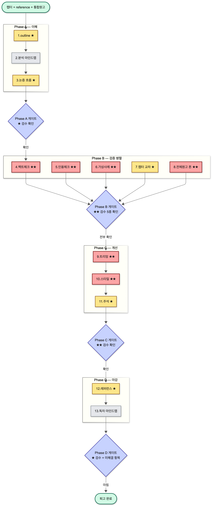
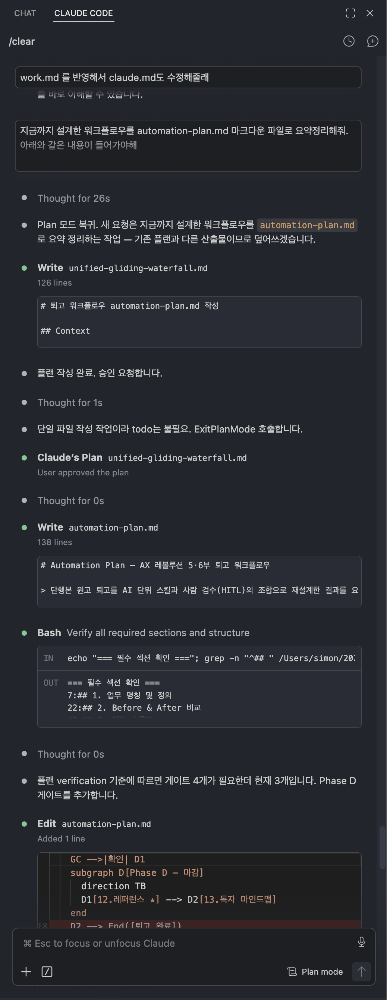

# Automation Plan — AX 레볼루션 5·6부 퇴고 워크플로우

> 단행본 원고 퇴고를 AI 단위 스킬과 사람 검수(HITL)의 조합으로 재설계한 결과를 요약합니다. 상세 사양은 [work.md](work.md), 실행 도구는 `~/.claude/commands/` 의 슬래시 명령들입니다.

---

## 1. 업무 명칭 및 정의

**업무명:** 단행본 『AX 레볼루션』 5·6부 원고 퇴고

**정의:** 본문의 **사실 정확성·인용 무결성·서사 구성·문장 스타일·전체원고 일관성**을 검증하고 다듬어 출간 가능한 수준으로 끌어올리는 작업.

**작업 단위:** 챕터 1개(약 500~600줄, 60~80개 사례·인용·수치를 포함).

**대상 자산:**
- 본문 [AX레볼루션_5부.md](AX레볼루션_5부.md), [AX레볼루션_6부.md](AX레볼루션_6부.md)
- 출처표 [reference_5부.md](reference_5부.md), [reference_6부.md](reference_6부.md)
- 전체원고 기준점 [AX레볼루션_통합원고.md](AX레볼루션_통합원고.md) (7,486줄)

---

## 2. Before & After 비교

| 항목 | Before (기존 8단계, 수동) | After (13단계, AI + HITL) |
|---|---|---|
| **단계 수** | 8 | 13 (확장되었으나 자동화로 시간 절감) |
| **챕터 1개 소요 시간** | 약 15~25시간 | 약 3~5시간 (사람 검수 시간 위주) |
| **주요 병목** | 본문↔출처 수동 cross-check, web 검색 반복, 전체원고 톤 비교(사실상 불가) | 검증 병목 거의 해소 — 작가 결정·통독 시간이 주된 부담 |
| **병렬화** | 불가 (한 사람 시야) | Phase B의 5개 검증을 동시 실행 |
| **검수 강제** | 약함 (작가 자율, 누락 빈번) | Phase 게이트가 ★★ 검수 카운트를 매번 노출, 스킵 불가 |
| **산출물 추적** | 메모·수기, 재실행 어려움 | 모든 보고서·outline·마인드맵이 파일로 저장 |

### 체감되는 변화

- **단순 복붙·수동 cross-check 작업 소멸** — 본문 인용과 reference 표를 손으로 대조하던 작업이 `/manuscript-references` 1회 호출로 끝남.
- **불가능했던 작업이 가능해짐** — 통합원고 7,486줄과 한 챕터의 voice 비교는 사람이 하기에는 비현실적이었으나, `/manuscript-tone` 으로 1회 실행 가능.
- **검수 강제** — Phase 게이트가 "이 ✅ N개, 🔴 M개를 모두 확인하셨나요?"를 매번 묻기 때문에, 깊이 보지 않고 넘어가던 검증이 사라짐.

> 시간 추정은 챕터 분량·web 검색 비용·검수 깊이에 따라 변동합니다. 위 수치는 5·6부 규모(섹션 11개·인용 60~80개) 기준의 대략적 가이드.

---

## 3. 업무 흐름도

> Mermaid 원본 소스는 [flowchart.md](flowchart.md) 에 보관. PNG 재생성이 필요하면 해당 파일을 렌더링.

**범례**
- 🟥 빨강 노드 (★★): 필수 검수, 스킵 불가
- 🟨 노랑 노드 (★): 강력 권장 검수
- ⬜ 회색 노드: 선택적 확인
- 🟦 파랑 다이아몬드: Phase 게이트 — 작가가 검수 카운트를 확인하고 "전부 확인" 을 선택해야 다음 Phase 진입
- 🟩 초록 캡슐: 시작·종료 지점
- 오케스트레이터: `/revise-chapter <챕터> [reference] [통합원고]` 가 전체를 순차 실행

---

## 4. AI 협업 포인트

| 단계 | Phase | AI 작업 (스킬) | 사람 검수 (등급) |
|---|---|---|---|
| 1 outline | A | `/manuscript-outline` — 본문 → 단락 핵심·사례 트리 | 누락된 사례 보강 (★) |
| 2 분석 마인드맵 | A | `/manuscript-mindmap analysis` — Markmap/Mermaid 자동 생성 | 시각적 확인 (선택) |
| 3 논증 흐름 | A | `/manuscript-flow` — 단락 연결·균형·회수되지 않은 선언 | 의도된 단절 vs 누락 결정 (★) |
| 4 팩트체크 | B | `/manuscript-factcheck` — reference ⚠️/🔴 항목 섹션별 병렬 web 검증, 마커 자동 갱신 | ✅ 분류 중 맥락 오용 5~10개 재확인, ⚠️ 수정안 전수 승인, 실명 부정 주장 명예훼손 점검 **(★★)** |
| 5 인용체크 | B | `/manuscript-citecheck` — 인용 문장 web 비교, 표절 위험 5단계 분류 | 🔴 전수 검토, 🟡 의역도 한 번 더 **(★★)** |
| 6 가상사례 명시 | B | `/manuscript-fiction-check` — 🔵 사례별 본문 "가상" 명시 결정론적 grep | "가상" 단어 존재가 아니라 *오인 가능성이 사라졌는지*, 가상 사례 안 실명 혼입 통독 확인 **(★★)** |
| 7 챕터 교차 | B | `/manuscript-crosscheck` — 챕터 간 용어·인물·반복 주장 정합성 | 충돌 항목별 정본 결정 (★) |
| **8 전체원고 톤** | **B** | `/manuscript-tone` — 챕터 ↔ 통합원고 voice 시그니처(문장 길이·종결어미·강조·인칭) 비교 | 🔴 강한 일탈 전수 + 챕터 통독으로 "이 챕터만 다른 책 같은가" 직관 검사 **(★★)** |
| 9 트리밍 | C | `/manuscript-trim` — 반복·약한 단락 컷·축약 후보 | 모든 컷 결정 — AI가 "약하다" 본 게 voice·리듬일 수 있음 **(★★)** |
| 10 스타일 | C | `/manuscript-style` — 가독성·표현·어법 diff 제안 (자동 적용 금지) | 모든 diff 채택 결정 — voice 평준화 위험 **(★★)** |
| 11 주석 | C | `/manuscript-annotate` — 어려운 개념·용어 식별 + 각주 초안 | 채택 여부·분량 결정 (각주 과다 시 흐름 단절) (★) |
| 12 레퍼런스 | D | `/manuscript-references` — 본문↔reference 양방향 cross-check, 챕터말 인용 목록 초안 | 고아 항목 처리(삭제 vs 본문 인용 추가) 결정 (★) |
| 13 독자 마인드맵 | D | `/manuscript-mindmap reader` — 부록용 정제 마인드맵 | 부록 적합성 확인 (선택) |

### AI가 신뢰할 만한 영역과 그렇지 않은 영역

**AI에게 안심하고 맡길 수 있는 작업**
- web 검색을 통한 출처·수치 1차 확인
- 본문 ↔ reference 양방향 매칭 (결정론적 grep·표 파싱)
- 마인드맵·outline 같은 구조화 산출물 생성

**AI 결과를 반드시 사람이 한 번 더 봐야 하는 영역 (★★)**
- **사실의 맥락** — ✅ 정확 판정이라도 본문이 출처를 *잘못된 일반화로 끌어다 썼는지* 는 사람만 안다.
- **표절 경계** — 의역과 차용 사이의 선은 AI 판단 정확도가 가장 낮은 영역.
- **가상 사례 안의 실명 혼입** — 단어 존재 검사로는 잡히지 않음. 작가 통독 필수.
- **voice·리듬** — 트리밍과 스타일 제안에서 AI는 평균값으로 끌어내릴 위험. 작가 직관이 최종 결정.
- **전체원고와의 톤 일관성** — 통계적 일탈이 *의도된 변주*인지 *표류*인지는 사람만 판단.

### 운영 원칙

1. **본문은 작가 승인 없이 자동 수정되지 않습니다.** 모든 단위 스킬은 *제안·보고서* 만 산출. 예외: `/manuscript-factcheck` 의 reference 마커 갱신 (사양에 명시).
2. **Phase 게이트는 검수 카운트를 노출.** "확인했나요?" 가 아니라 "✅ N개·🔴 M개·🟡 K개를 모두 확인했나요?"를 매번 제시 — 깊이 보지 않고 진행하는 일을 구조적으로 차단.
3. **단위 스킬은 독립 호출 가능.** 전체를 다 돌리지 않고 특정 단계만 빠르게 검증하고 싶을 때 `/manuscript-factcheck`, `/manuscript-tone` 등을 직접 호출.

---

## 부록 : 증명 스크린샷

