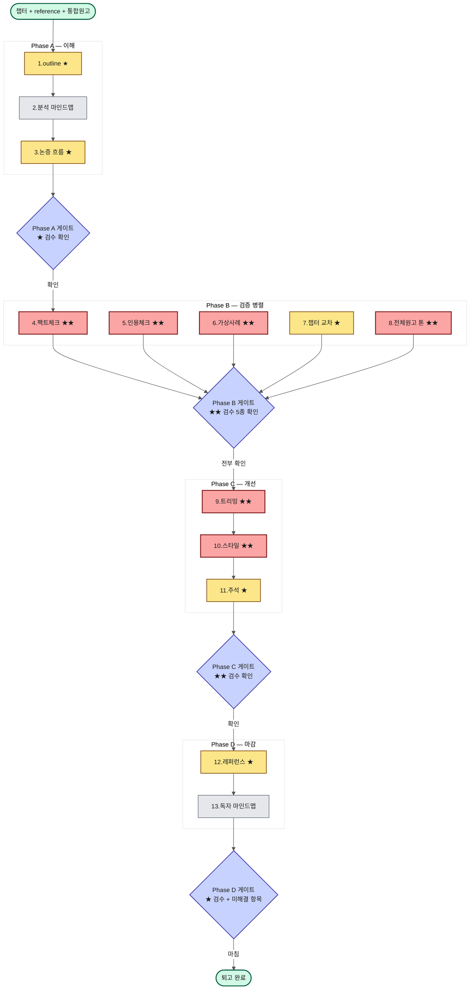

# AX 레볼루션 5·6부 퇴고 워크플로우 — 업무 흐름도

이 파일은 [automation-plan.md](automation-plan.md) 의 업무 흐름도 Mermaid 소스입니다. 렌더링 후 `flowchart.png` 로 저장해 automation-plan.md 의 이미지 자리에 사용합니다.

## 렌더링 방법

- **Mermaid Live Editor** (https://mermaid.live) — 코드 붙여넣고 PNG export
- **mermaid-cli** — `mmdc -i flowchart.md -o flowchart.png` (Node.js 환경)
- **VS Code Mermaid 확장** — 미리보기에서 우클릭 → 이미지로 저장

## 다이어그램

